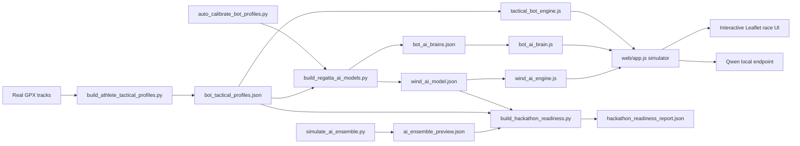

# TacticalSail AI STEM

TacticalSail AI STEM is a data-driven 2D sailing race simulator for ILCA 4 tactics on Lake Garda.

The project turns real GPS race tracks into AI-controlled virtual sailors. Each bot is built from a real athlete profile, a local tactical decision engine, and a wind model trained from Garda race data. The goal is educational: show young sailors why a tactical choice worked, where they lost VMG, and how wind shifts, pressure, laylines, dirty air, and maneuver timing change the race.

## Demo

Run the local web demo:

```bash
python3 scripts/serve_ui.py --host 127.0.0.1 --port 8002
```

Open:

```text
http://127.0.0.1:8002/web/
```

The current demo build is `app.js?v=112`.

## Hackathon Status

Current automated readiness:

```text
95.4% hackathon-ready
```

This is not presented as a finished product. It is a measured prototype with visible strengths and visible limits.

What is already working:

- 54 clean real GPX race tracks organized across 7 sailors.
- 7 athlete-specific bot brains.
- Automatic GPX-to-bot calibration: 78.8% base fit -> 91.6% calibrated fit.
- 100 generated wind AI scenarios.
- 57 wind variables per scenario window.
- Area B course sequence with locked marks.
- Anti-land runtime guard.
- Replay/ghost similarity and hackathon QA panel.
- Local Qwen 3.5 4B decision endpoint with offline fallback.
- Apple Silicon and Windows-capable local model backend selection.

Main known weakness:

- The model is now strong for hackathon judging, but still needs deeper GPX-vs-simulation validation before being used as a serious training tool.

## Why It Is Innovative

Most sailing tools replay data or show a static track. TacticalSail tries to emulate *decision style*.

Instead of only asking "who was faster?", the simulator asks:

- Did this sailor prefer the left, right, or center?
- Did they tack on headers or hold long boards?
- Did they sail near the edge or recover to the center?
- Did pressure, lift, dirty air, or layline risk drive the next maneuver?
- Can a bot reproduce that athlete's style without copying one track rigidly?

The answer is shown live in the UI:

- `Hackathon QA`: readiness, replay similarity, wind scenario, course lock.
- `Live tactics`: selected boat action, side, score, and reason.
- `Wind`: pressure, scenario source, and wind zone.
- `Engine QA`: VMG, turn count, speed trend, and engine notes.

## Architecture



## Main Code Areas Judges Should Inspect

### Frontend simulator

- `web/app.js`
  - map, race loop, bot movement, route control, UI panels, Qwen payloads
- `web/tactical_bot_engine.js`
  - measurable tactical score function
- `web/bot_ai_brain.js`
  - per-athlete policy and neural modulation runtime
- `web/wind_ai_engine.js`
  - 100-scenario wind AI sampler
- `web/index.html`
  - demo UI
- `web/styles.css`
  - tactical dashboard styling

### Data and validation pipeline

- `scripts/build_athlete_tactical_profiles.py`
  - parses GPX, extracts athlete tactical style
- `scripts/build_regatta_ai_models.py`
  - builds bot brains and wind AI scenarios
- `scripts/auto_calibrate_bot_profiles.py`
  - fits each athlete brain against GPX-derived side and maneuver targets
- `scripts/simulate_ai_ensemble.py`
  - runs 100 lightweight race variants
- `scripts/build_hackathon_readiness.py`
  - produces readiness and replay validation reports
- `scripts/verify_hackathon_demo.py`
  - verifies minimum demo contract

### Prompt engineering and local model runtime

- `src/the_mastery_mentors/context_builder.py`
  - structured prompt payload builder
- `src/the_mastery_mentors/qwen_runtime.py`
  - Apple/Windows/backend selection and Qwen execution
- `scripts/serve_ui.py`
  - `/api/qwen/decision` endpoint and JSON fallback decision logic
- `docs/PROMPT_ENGINEERING.md`
  - human-readable prompt strategy and safety constraints

## Data

Organized athlete tracks live in:

```text
data/regattas/athlete_tracks/
```

Current clean dataset:

```text
54 valid GPX tracks
2 excluded tracks
7 sailors
```

Generated AI files:

```text
data/generated/bot_tactical_profiles.json
data/generated/bot_auto_calibration.json
data/generated/bot_ai_brains.json
data/generated/wind_ai_model.json
data/generated/ai_ensemble_preview.json
data/generated/hackathon_readiness_report.json
data/generated/replay_validation.json
```

## Rebuild Everything

```bash
python3 scripts/build_athlete_tactical_profiles.py \
  --dataset data/regattas/athlete_tracks \
  --out data/generated/bot_tactical_profiles.json

python3 scripts/build_regatta_ai_models.py \
  --dataset data/regattas/athlete_tracks \
  --profiles data/generated/bot_tactical_profiles.json \
  --calibration data/generated/no_auto_calibration_yet.json \
  --out-dir data/generated \
  --scenarios 100

python3 scripts/auto_calibrate_bot_profiles.py \
  --profiles data/generated/bot_tactical_profiles.json \
  --wind data/generated/wind_ai_model.json \
  --brains data/generated/bot_ai_brains.json \
  --out data/generated/bot_auto_calibration.json

python3 scripts/build_regatta_ai_models.py \
  --dataset data/regattas/athlete_tracks \
  --profiles data/generated/bot_tactical_profiles.json \
  --calibration data/generated/bot_auto_calibration.json \
  --out-dir data/generated \
  --scenarios 100

python3 scripts/simulate_ai_ensemble.py \
  --wind data/generated/wind_ai_model.json \
  --brains data/generated/bot_ai_brains.json \
  --out data/generated/ai_ensemble_preview.json

python3 scripts/build_hackathon_readiness.py \
  --profiles data/generated/bot_tactical_profiles.json \
  --wind data/generated/wind_ai_model.json \
  --ensemble data/generated/ai_ensemble_preview.json

python3 scripts/verify_hackathon_demo.py
```

## Verification

Run:

```bash
node --check web/app.js
node --check web/tactical_bot_engine.js
node --check web/bot_ai_brain.js
node --check web/wind_ai_engine.js
python3 -m py_compile scripts/*.py src/the_mastery_mentors/*.py
python3 scripts/verify_hackathon_demo.py
```

The demo verifier checks:

- 57 wind variables
- at least 100 wind scenarios
- 7 bot AI brains
- replay validation for 7 bots
- hackathon readiness above threshold
- Hackathon QA UI exists
- anti-land guard exists
- current app bundle is loaded

## Local AI Runtime

The runtime chooses a local backend automatically:

- Apple Silicon/macOS: MLX with `mlx-community/Qwen3.5-4B-MLX-4bit`
- Windows: Transformers/PyTorch with CUDA, DirectML if installed, then CPU fallback
- Other systems: Transformers/PyTorch fallback

Force backend:

```bash
QWEN_BACKEND=mlx python3 -m the_mastery_mentors.cli smoke-test
QWEN_BACKEND=transformers python3 -m the_mastery_mentors.cli smoke-test
```

## Devpost Pitch

The short pitch is in:

```text
docs/PITCH_SCRIPT.md
```

The submission copy is in:

```text
docs/DEVPOST_SUBMISSION.md
```

## What To Improve Next

To move from hackathon demo to a real training product:

1. Run long browser stress tests for full race duration.
2. Validate mark rounding against official race committee geometry.
3. Record a clean 2-3 minute demo video.
4. Add unit tests for mark rounding, gate choice, and finish crossing.
5. Expand the auto-calibration set with more regattas per sailor.

The biggest remaining technical gap is product-grade validation, not hackathon demo readiness.
